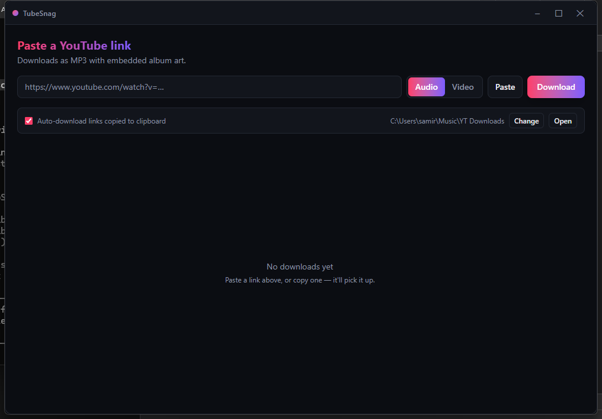
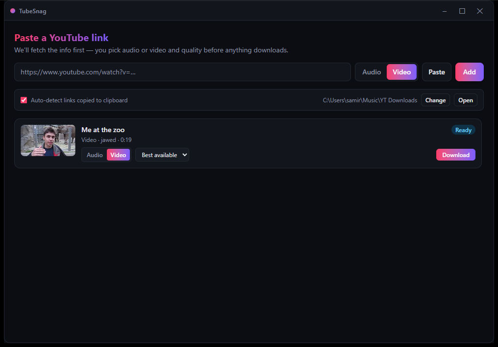

# TubeSnag

**TubeSnag** is a fast, open-source desktop app for downloading YouTube videos as **MP3** (with embedded album art) or **MP4** — paste a link, or just copy one and it grabs it automatically. Built with [Tauri](https://tauri.app), React, and [yt-dlp](https://github.com/yt-dlp/yt-dlp).


## Screenshots

| Idle | Preview + quality picker |
|---|---|
|  |  |

## Features

- 🎵 **Audio mode** — downloads the best available audio, converts to MP3, and embeds the video thumbnail as album art
- 🎬 **Video mode** — downloads and merges the best video + audio into MP4
- 📋 **Clipboard auto-download** — copy a YouTube link anywhere and TubeSnag detects it and starts downloading, no need to switch windows
- 📊 **Live progress** — per-download progress bar, speed, and ETA, with multiple downloads running in parallel
- 📁 **Configurable save folder** — pick where files land, open the folder from the app
- 🌓 **Clean dark UI** — custom titlebar, no browser chrome, just the app
- 💾 **Settings persist** — save folder, auto-download toggle, and audio/video mode are remembered between launches

## Why

Most YouTube-downloader GUIs are either abandoned Electron apps bundling a stale `youtube-dl`, or a bare command line. TubeSnag wraps the actively-maintained [yt-dlp](https://github.com/yt-dlp/yt-dlp) engine in a small, fast native app (Tauri, not Electron — no bundled Chromium), with a UI built around the one workflow that actually matters: copy a link, get a file.

## Tech stack

| Layer | Tech |
|---|---|
| Shell | [Tauri 2](https://tauri.app) (Rust) |
| UI | React + TypeScript + Tailwind CSS |
| Download engine | [yt-dlp](https://github.com/yt-dlp/yt-dlp) (bundled as a sidecar binary) |
| Media processing | [FFmpeg](https://ffmpeg.org) (bundled as a sidecar binary) |

## Getting started (build from source)

Currently Windows-only. You'll need:

- [Node.js](https://nodejs.org) 18+
- [Rust](https://www.rust-lang.org/tools/install) (stable, MSVC toolchain)
- [Visual Studio Build Tools](https://visualstudio.microsoft.com/visual-cpp-build-tools/) with the "Desktop development with C++" workload

```bash
git clone https://github.com/SamirWagle/tubesnag.git
cd tubesnag
npm install
npm run setup      # downloads the yt-dlp.exe / ffmpeg.exe sidecar binaries
npm run tauri dev  # launches the app in dev mode
```

To build an installable `.msi`/`.exe`:

```bash
npm run tauri build
```

## How it works

TubeSnag doesn't reimplement a YouTube downloader — it drives `yt-dlp` and `ffmpeg` as bundled sidecar processes and streams their progress into the UI. Downloads land in a temp folder first and are moved into your chosen save folder only once complete, so a half-finished download never shows up as a real file (and it sidesteps cloud-sync tools like OneDrive locking files mid-write).

## Roadmap

- [ ] Auto-update yt-dlp from within the app
- [ ] Download history / library view
- [ ] Playlist support
- [ ] Quality picker (bitrate / resolution)
- [ ] Pause/cancel individual downloads
- [ ] System tray minimize

Contributions welcome — open an issue or PR.

## Disclaimer

TubeSnag is a personal-use tool for downloading content you have the right to download (your own uploads, Creative Commons content, or videos where the creator/platform permits it). Respect copyright and each platform's terms of service.

## License

[MIT](./LICENSE) © Samir Wagle
